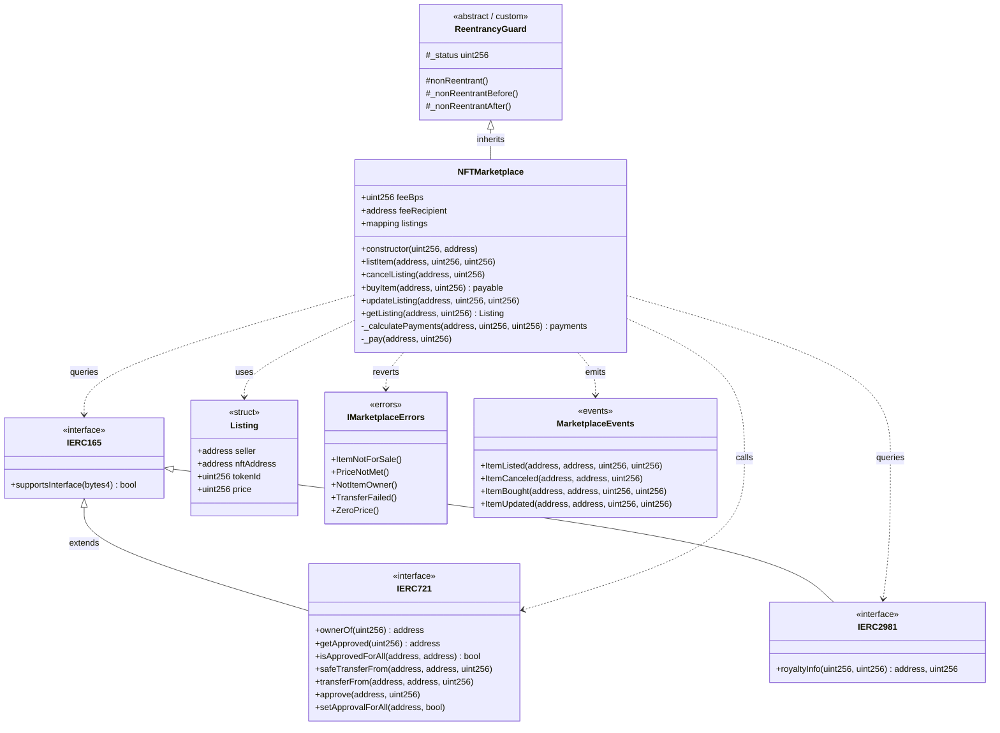
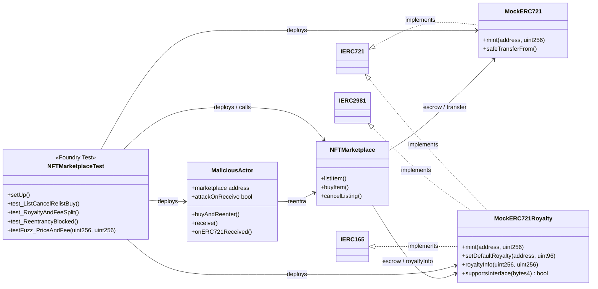

# Diagrama de clases — NFT Marketplace

Modelo estructural de contratos, interfaces, structs y actores de test.

## 1. Diagrama principal (UML / Mermaid)



## 2. Contratos de prueba (mocks)



## 3. Responsabilidades por clase

| Clase / artefacto | Responsabilidad |
|-------------------|-----------------|
| `NFTMarketplace` | Escrow, listings, compra atómica, split de pagos, guards |
| `Listing` | Datos mínimos de una venta activa |
| `ReentrancyGuard` | Bloqueo de reentrada en `buyItem` / `cancelListing` |
| `IERC721` | Custodia y transferencia del NFT |
| `IERC2981` | Cálculo de royalty por venta |
| `IERC165` | Detección de soporte ERC-2981 |
| `MockERC721` | NFT de test sin royalties |
| `MockERC721Royalty` | NFT de test con royalties |
| `MaliciousActor` | Intento de reentrancy en receive/fallback |
| `NFTMarketplaceTest` | Cobertura unitaria, seguridad y fuzz |

## 4. Relaciones de dependencia (resumen)

```
NFTMarketplace
  ├── hereda     → ReentrancyGuard
  ├── almacena   → Listing (mapping)
  ├── integra    → IERC721 (transferencias)
  ├── consulta   → IERC165 + IERC2981 (royalties)
  ├── emite      → ItemListed / ItemCanceled / ItemBought / ItemUpdated
  └── revierte   → custom errors
```

## 5. Layout Solidity del contrato principal

Orden de layout según convención del monorepo:

1. Interfaces / imports  
2. Libraries (si aplica)  
3. Contract `NFTMarketplace`  
4. Type declarations (`Listing`)  
5. State variables (`feeBps`, `feeRecipient`, `listings`)  
6. Events  
7. Errors  
8. Modifiers (`nonReentrant` vía herencia)  
9. Functions: constructor → external → public → internal → private  
