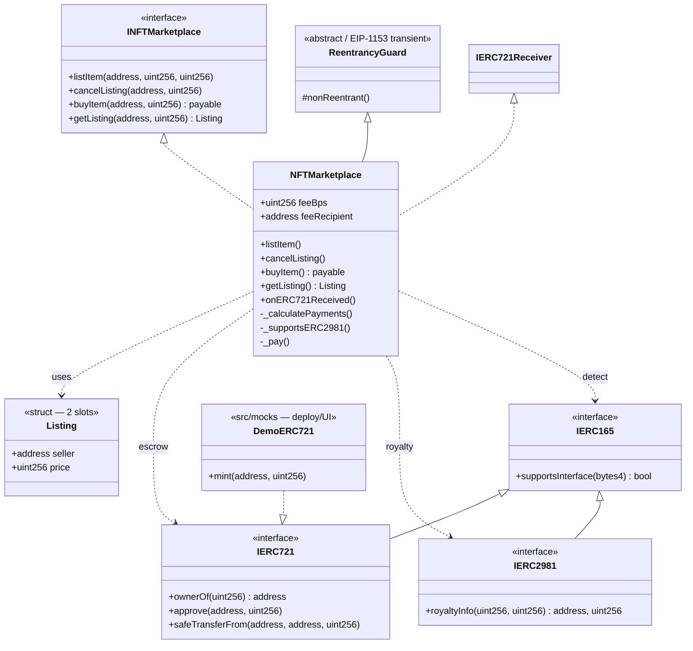
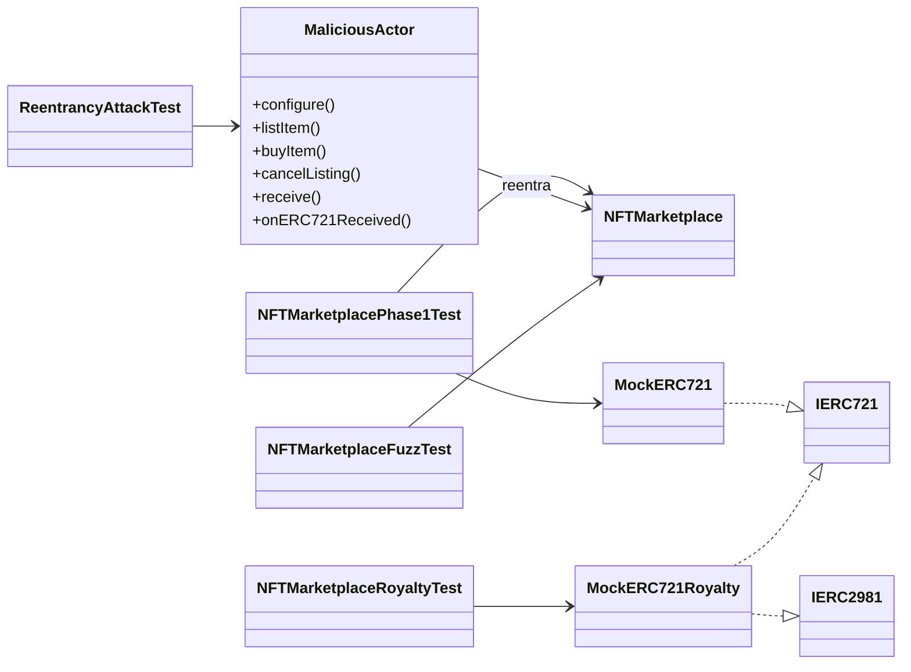
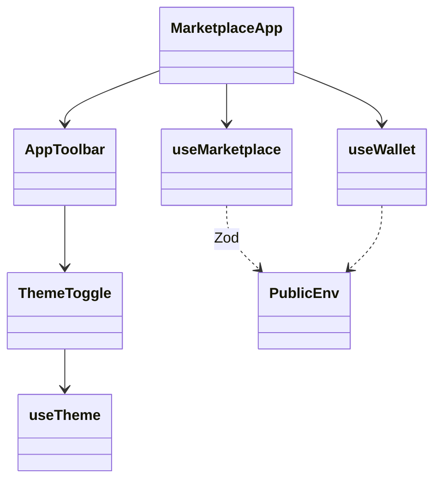

# Diagrama de clases — NFT Marketplace

Modelo estructural **as-built** (módulo cerrado): contratos, mocks, tests y demo.

## 1. Diagrama principal (UML / Mermaid)



## 2. Tests y actores maliciosos



## 3. Frontend (demo)



## 4. Responsabilidades

| Artefacto | Rol |
|-----------|-----|
| `NFTMarketplace` | Escrow, list/cancel/buy, split fee/royalty/seller |
| `Listing` | `{seller, price}` — 2 slots; claves = nft + tokenId |
| `ReentrancyGuard` | Lock transient en buy/cancel |
| `DemoERC721` | NFT de demo para Anvil / UI |
| `MockERC721` / `MockERC721Royalty` | Tests Foundry |
| `MaliciousActor` | Vectores SWC-107 |
| `MarketplaceApp` | UI: mintear, listar, cancelar, comprar |
| `ThemeToggle` / `useTheme` | Claro / oscuro (`market-theme`) |

## 5. Dependencias (resumen)

```
NFTMarketplace
  ├── hereda     → ReentrancyGuard (transient)
  ├── implementa → INFTMarketplace, IERC721Receiver
  ├── almacena   → Listing (2 slots)
  ├── integra    → IERC721
  ├── consulta   → IERC165 + IERC2981
  ├── emite      → ItemListed / ItemCanceled / ItemBought
  └── revierte   → custom errors (INFTMarketplace)
```

## 6. Layout Solidity

1. Imports / interfaces  
2. Contract `NFTMarketplace`  
3. State (`feeBps`, `feeRecipient`, `_listings`) — `Listing` en la interfaz  
4. Constructor → external (`listItem`, `cancelListing`, `buyItem`, `getListing`)  
5. `onERC721Received`  
6. Private: `_calculatePayments`, `_supportsERC2981`, `_pay`
