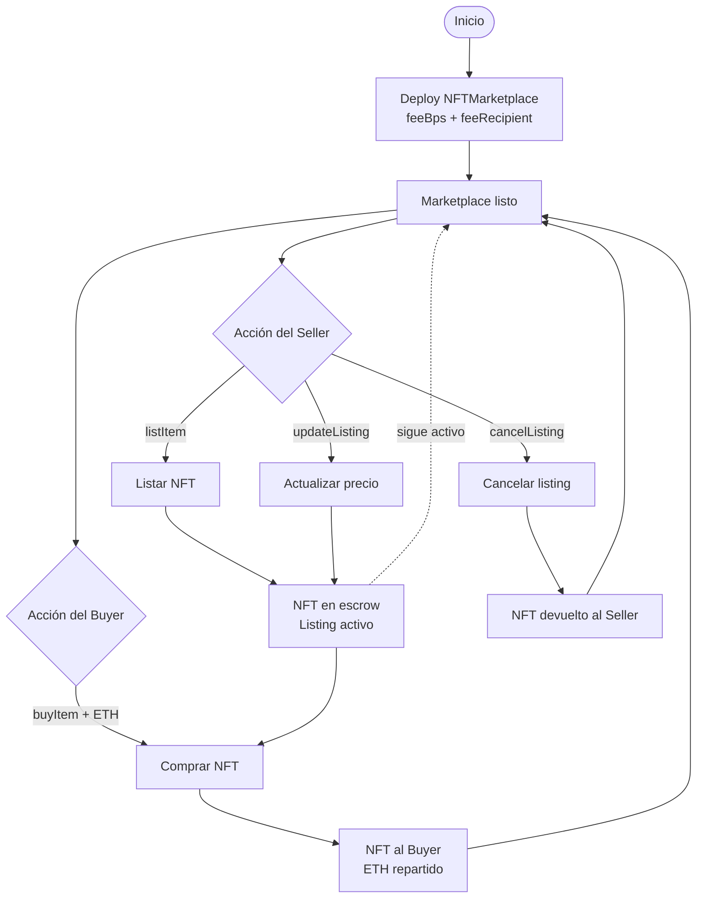
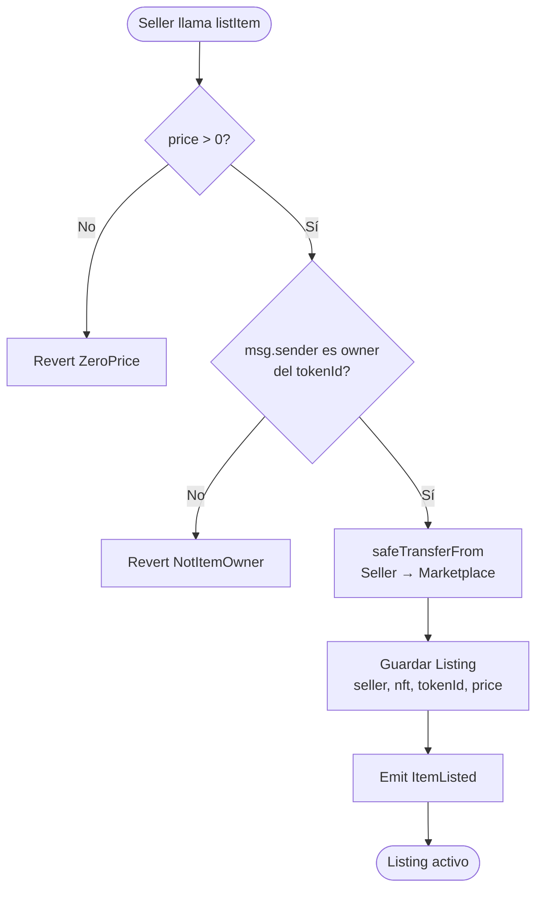
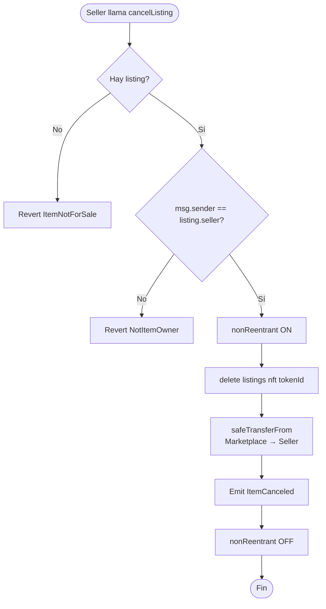
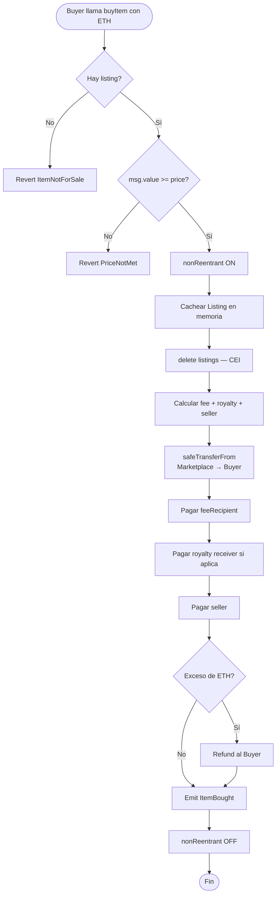
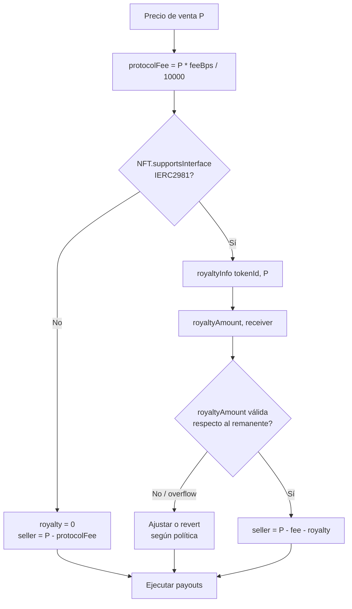

# Diagrama de flujo — NFT Marketplace

Flujo de procesos de negocio del marketplace (vista de alto nivel).

## 1. Ciclo de vida completo del listing

## 2. Flujo de listado (`listItem`)

## 3. Flujo de cancelación (`cancelListing`)

## 4. Flujo de compra (`buyItem`)

## 5. Decisión de royalties (ERC-2981)

## Leyenda

| Símbolo | Significado |
|---------|-------------|
| Rectángulo | Proceso / acción |
| Diamante | Decisión / validación |
| Óvalo | Inicio / fin |
| Flecha punteada | Estado persistente |
