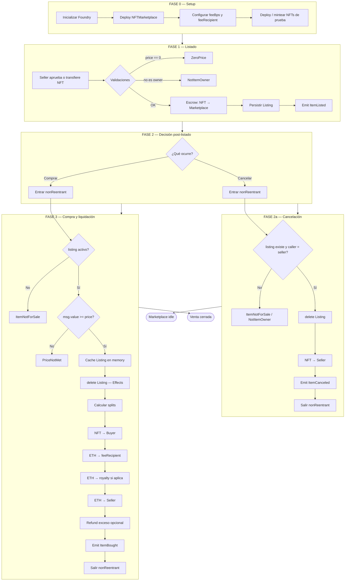
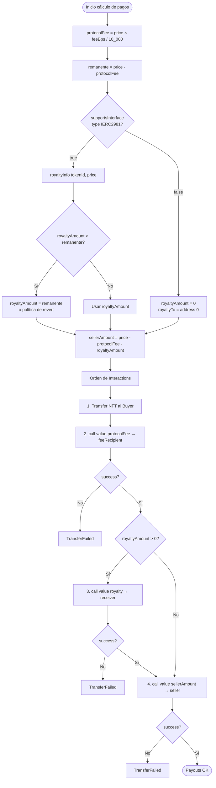
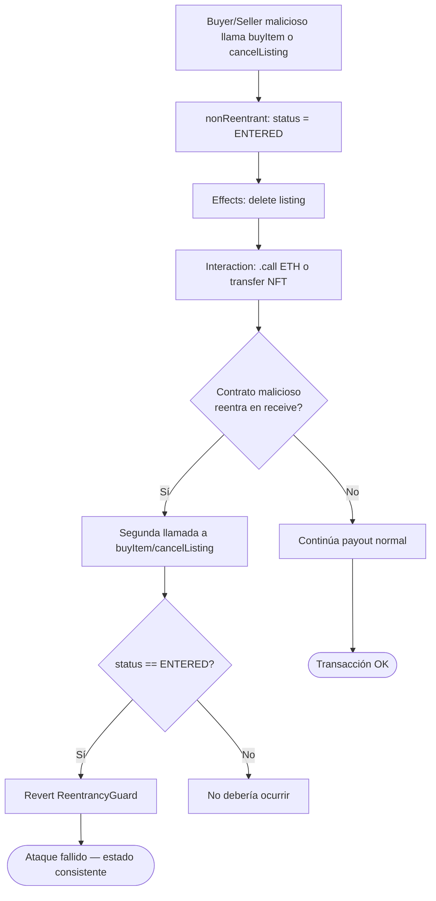
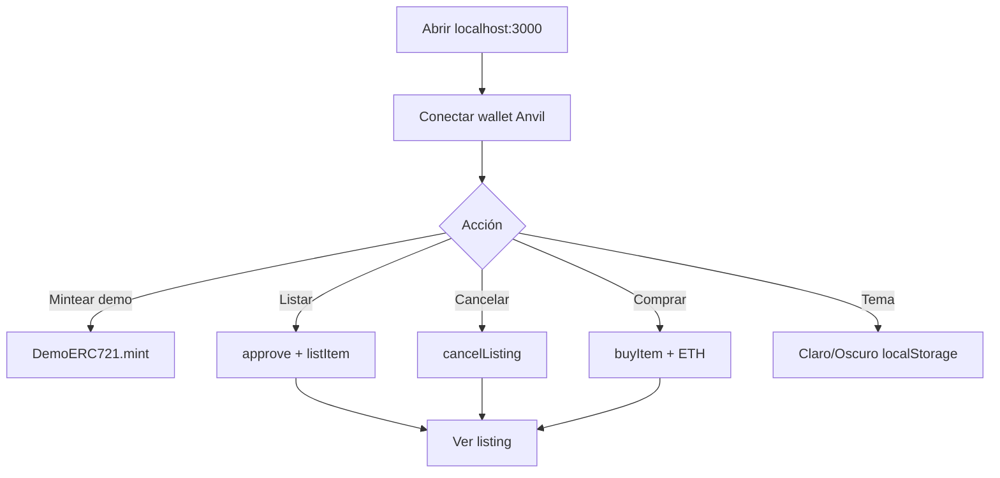

# Flujograma del proyecto — NFT Marketplace

Flujograma operativo **as-built** (v1): setup → list → cancel/buy → payouts → seguridad → UI.

## 1. Flujograma maestro del sistema

## 2. Flujograma detallado de liquidación (payouts)

## 3. Flujograma de seguridad (reentrancy)

## 4. Flujograma del pipeline de desarrollo (TDD) — cumplido

```mermaid
flowchart LR
    A[.cursorrules] --> B[Tests .t.sol rojos]
    B --> C[listItem]
    C --> D[cancelListing + guard]
    D --> E[buyItem + fee]
    E --> F[ERC-2981]
    F --> G[Attack SWC-107]
    G --> H[Fuzz 1000]
    H --> I[Gas + NatSpec]
    I --> J[Demo Next.js + tema]
    J --> K([Módulo cerrado])
```

## 5. Matriz flujo ↔ función ↔ invariante

| Paso del flujograma | Función | Invariante |
|---------------------|---------|------------|
| Escrow al listar | `listItem` | `ownerOf(tokenId) == marketplace` |
| Listing activo | storage | `listings[nft][id].seller != 0` |
| Cancelación | `cancelListing` | NFT vuelve al seller; listing borrado |
| Pre-compra | `buyItem` | `msg.value >= price` |
| Post-effects | `buyItem` | listing borrado **antes** de calls |
| Post-compra | `buyItem` | `ownerOf == buyer`; suma payouts = price |
| Reentrada | guard transient | segunda llamada revierte |
| Sin ERC-2981 | payout | seller recibe `price - fee` |
| Con ERC-2981 | payout | fee + royalty + seller = price |

## 6. Flujo UI (demo)

## 7. Cómo leer estos diagramas

1. **Setup → Listado**: estado on-chain.  
2. **Branch**: cancelar o comprar (no hay `updateListing` en v1).  
3. **Compra**: CEI + splits + eventos.  
4. **Seguridad / fuzz / UI**: cierre del módulo (fases 0–8 + demo).
